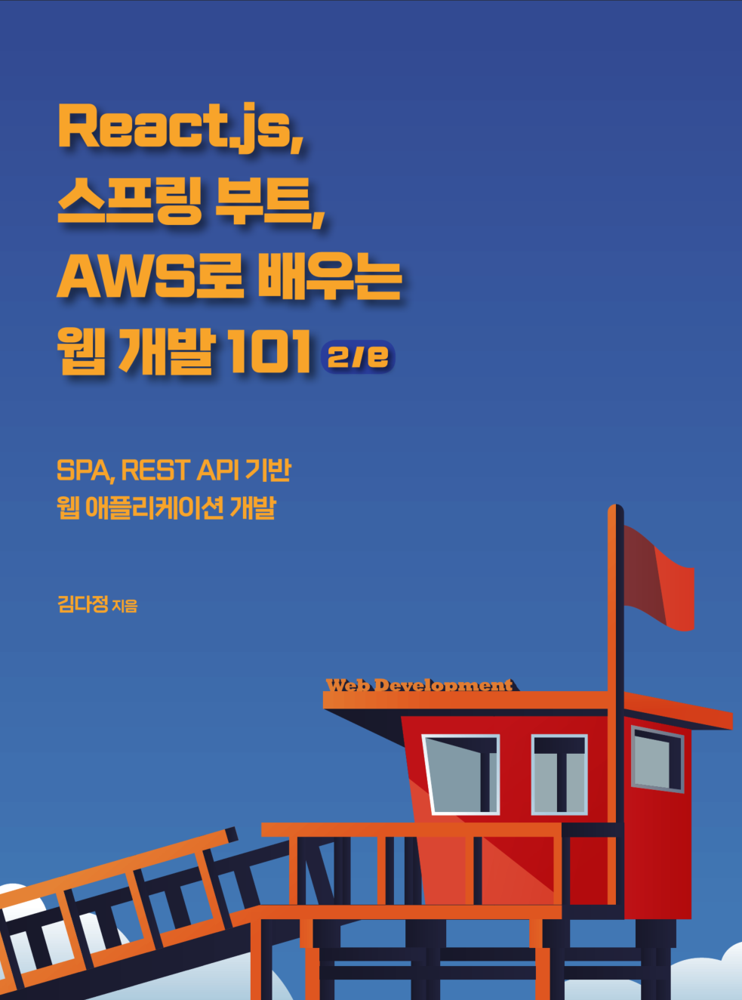

# react-springboot-aws
📚 IT 서적 & 모행스터디

# 스터디 정보
2025.01.20 (월) ~

모행스터디(5인)

# 책 정보
React.js, 스프링 부트, AWS로 배우는 웹 개발 101

김다정 지음

간단한 Todolist 서비스를 Backend는 Java REST API로, Frontend는 React.js로 만들어서 AWS로 배포해보는 내용.

# 기술 스텍, 사용 툴

sts4, intellij Community, SourceTree, postman 등

### Frontend
React.js

### Backend
Java 17, Spring Boot (Gradle), JPA

### Deploy
AWS
